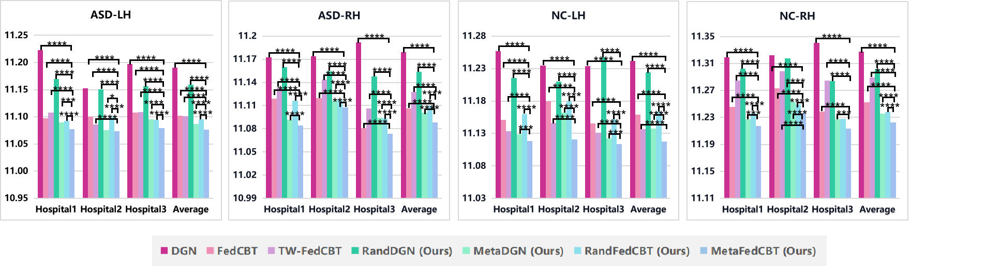
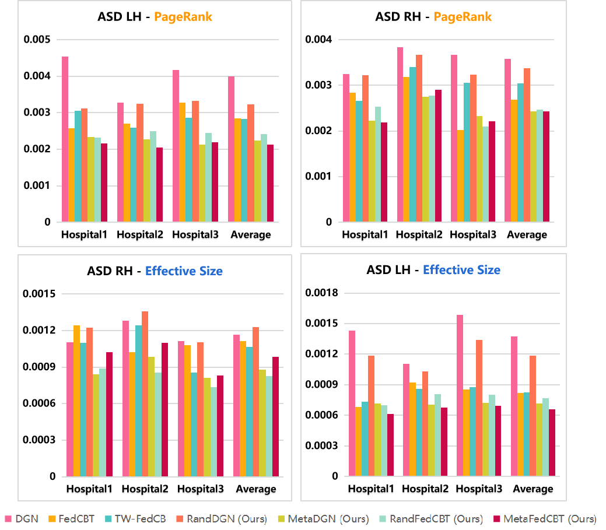
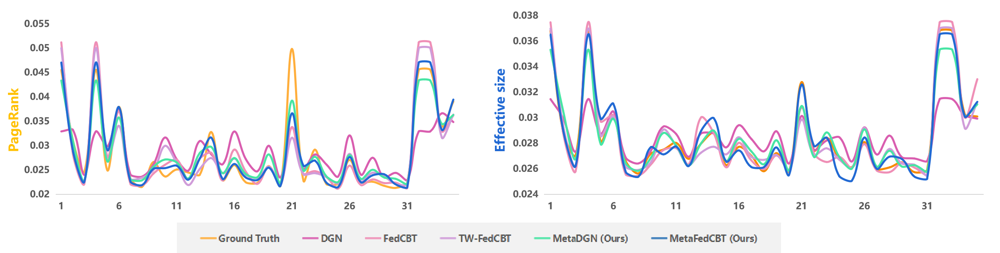
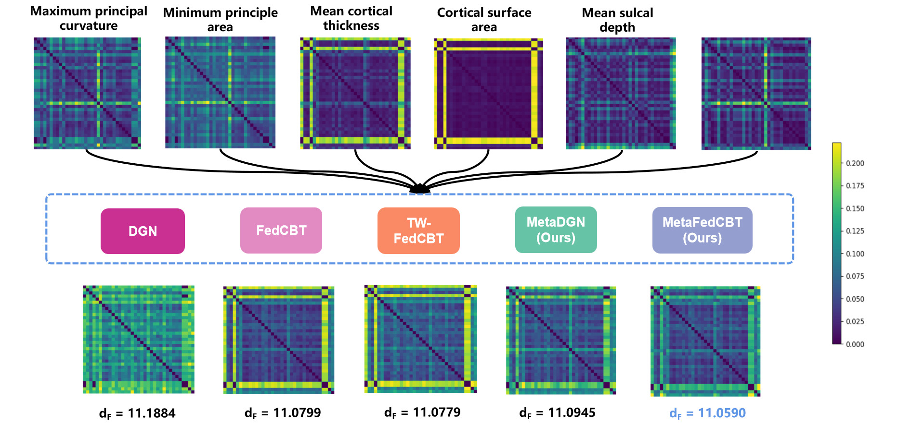

# MetaFedCBT
Metadata-Driven Federated Learning of Connectional Brain Templates in Non-IID Multi-Domain Scenarios

## Code
Coming soon.

## 1.Data Format
In case you want to use Fed-CBT on your multiview networks, we represent each multiview brain network with a stacked symmetrical connectivity matrices. Therefore our model expects you to provide a path of numpy array saved as a binary file in NumPy .npy format with shape [#Subjects, #Nodes, #Nodes, #Views]. 

## 2.Results 
  
  
  
  

The figure compares CBTs of a population of subjects where each subject has 6 views (each represented by 35 by 35 matrix). Our code takes in a numpy array of size [35, 35, 6] and outputs a 35 by 35 matrix.

