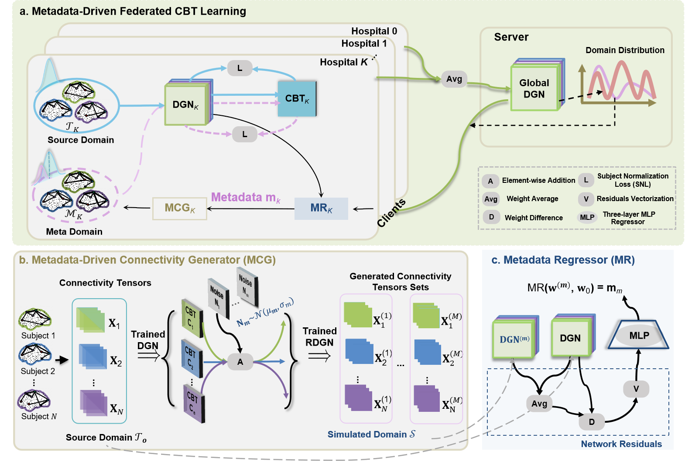

# MetaFedCBT
Metadata-Driven Federated Learning of Connectional Brain Templates in Non-IID Multi-Domain Scenarios



## Usage

## 1.Data 
This project uses multi-view brain connectivity data from the public ABIDE-I dataset (Autism Brain Imaging Data Exchange), which includes two groups: Normal Control (NC) and Autism Spectrum Disorder (ASD). The data is divided by left hemisphere (LH) and right hemisphere (RH).The directory structure is organized as follows:
```python
inputs/
├── ASD_LH/          # Left hemisphere ASD dataset (Autism Spectrum Disorder)
│   ├── fold0/        # 4-fold cross-validation - Fold 0
│   │   ├── fold0_train_data.npy  # Training data
│   │   ├── fold0_test_data.npy   # Test data
│   │   └── client_data_fold_0.pkl # Client data index (for federated learning)
│   ├── fold1/        # 4-fold cross-validation - Fold 1
│   ├── fold2/        # 4-fold cross-validation - Fold 2
│   └── fold3/        # 4-fold cross-validation - Fold 3
├── ASD_RH/          # Right hemisphere ASD dataset (Autism Spectrum Disorder)
├── NC_LH/           # Left hemisphere NC dataset (Normal Control)
└── NC_RH/           # Right hemisphere NC dataset (Normal Control)
```

## 2.Configs
Different experiments (e.g., dataset selection, training epoch adjustment) are controlled by the config.py file.

## 3.Train
This project adopts an integrated training pipeline of "metadata prediction-connectivity generation-federated aggregation", which needs to be started through the main script and supports switching between training and validation modes:
1. Start Federated Training
```python
# Run the main training script to automatically execute metadata generation, local training, and global aggregation
python train_MetaFedCBT.py
```
2. Model Validation (CBT Topological Soundness Evaluation)
```python
# Evaluate the topological consistency between CBT and real brain networks based on KL divergence
python eval_metaFedCBT_kl.py
```
3. Model Validation (CBT Discriminative Evaluation)
```python
# Evaluate the discriminative ability of CBT for ASD/NC using an SVM classifier (outputs Acc, Prec, Rec, F1)
python eval_metaFedCBT_classify.py
```


